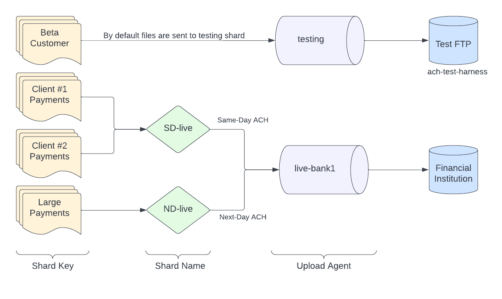

# Sharding

Shards are defined in ACHGateway as a logical grouping for ACH file delivery. There are countless patterns for describing file delivery within a business according to risk, feature delivery, fund availability, etc. Below is a sample sharding setup:

- `testing`: A shard used for automated and manual verification of the platform/feature. These files are never uploaded to the ODFI.
- `SD-live-bank1`: A shard for uploading ACH files according to the [Same-Day ACH windows](https://www.nacha.org/system/files/2021-03/SDA_Schedules_and_Funds_Availability.pdf).
- `ND-live-bank1`: A shard for uploading ACH files for the last Traditional ACH window.
- `SD-live-bank2`: Another FI used as an ODFI.

<a href="../images/OSS_Docs_Shard_Mapping.png"></a>

A business might have several customers that map to each shard. For example every new signup might be mapped to the `testing` shard until they're verified and onboarded successfully. Premium customers might be assigned to the `SD-live-bank1` window and free users may be mapped to `ND-live-bank1`.

The mapping is a `shardKey` (CustomerID, UUID, etc) to the `shardName` (e.g. `SD-live-bank1`). This configuration can be managed within ACHGateway via [HTTP endpoints](https://moov-io.github.io/achgateway/api/#tag--Shard-Mapping) or in the config file. Many implementations will also use a 1:1 mapping (`SD-live-bank1` -> `SD-live-bank1` and another database manages the mapping.

**Example**: Configure the [`Sharding` object](../../config/#sharding)

## Shard Configuration

Each shard has a wealth of configuration options, but the major options are:

- Upload Agent: SFTP or FTP transmission
- Cuttoff times: Wall clock times to trigger merge, upload, and notification
- Filename templates: Custom templating of uploaded filenames
- Audit Trail: Encrypted storage of uploaded and downloaded files
- Notifications: Email, PagerDuty, and Slack alerting of successful or failed processing
- Merge conditions: Maximum file dollar amounts, or line length restrictions

## Mapping

Refer to the [API endpoints](https://moov-io.github.io/achgateway/api/#tag--Shard-Mapping) for configuring shard mapping.

## Filename templates

ACHGateway supports templated naming of ACH files prior to their upload. This is helpful for ODFI's which require specific naming of uploaded files.Templates use Go's [`text/template` syntax](https://golang.org/pkg/text/template/) and are validated when ACHGateway starts or changed via admin endpoints.

Example:


```
{{ .ShardName }}-{{ date "20060102" }}-{{ .Index }}.ach{{ if .GPG }}.gpg{{ end }}
```


The following fields are passed to templates giving them data to build a filename from:

- `ShardName`: string of the shard performing an upload
- `GPG`: boolean if file is encrypted
- `Index`: integer starting from 0 of the Nth file uploaded during a cutoff from an ACHGateway instance

Also, several functions are available (in addition to Go's standard template functions)

- `date` Takes a Go [`Time` format](https://golang.org/pkg/time/#Time.Format) and returns the formatted string
- `env` Takes an environment variable name and returns the value from `os.Getenv`.
- `lower` and `upper` convert a string into lowercase or uppercase

Refer to the [`Shard` config section](../../config/#sharding) to tweak the `OutboundFilenameTemplate`.
